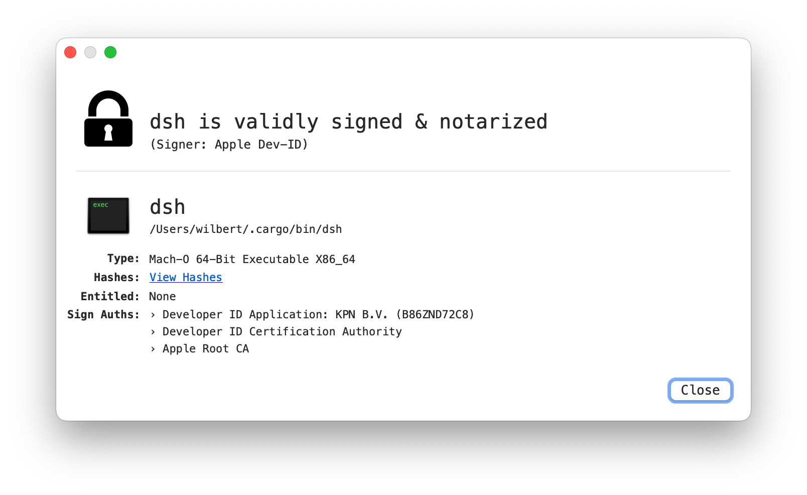

# Codesign for macOS

On devices with macOS 10.15 or higher all apps distributed outside the App Store must be signed
by the developer using an Apple-issued Developer ID certificate and notarised by Apple to run
under the default Gatekeeper settings. Apps developed in-house should also be signed with an
Apple-issued Developer ID so that users can validate their integrity.

Code signing is performed by the developer using their Developer ID certificate (issued by Apple).
Verification of this signature proves to the user that a developer’s software hasn’t been tampered
with since the developer built and signed it.

Notarisation can be performed by anyone in the software distribution chain and proves
that Apple has been provided a copy of the code to check for malware and no known malware was found.
The output of Notarisation is a ticket which is stored on Apple servers and can be optionally stapled to the app
(by anyone) without invalidating the signature of the developer.

More information about codesigning, notarisation and some of the other steps can be found on the
following pages:

* [App code signing process in macOS](https://support.apple.com/en-gb/guide/security/sec3ad8e6e53/web)
* [Notarizing macOS software before distribution](https://developer.apple.com/documentation/security/notarizing-macos-software-before-distribution)
* [Sign in to apps with your Apple Account using app-specific passwords](https://support.apple.com/en-us/102654)

## Prerequisites

### Binary

This explanation assumes that you already built the `dsh` tool for release and that the generated
macOS compatible binary is in the file system at `target/release/dsh`.
When a release consists of multiple binaries (e.g. a version with the `manage` feature
enabled and a version without that feature), the steps described below must be executed for
each version.

### KPN Developer Certificate and Team

If you want to codesign and notarise the `dsh` tool as a genuine KPN-application you need:

* the KPN Developer Certificate installed on your development machine and
* an Apple developer account that is a member of the KPN Apple Development Team that owns the
  certificate (team id `B86ZND72C8`).

The certificate as well as the development team are owned/maintained by the KPN App Center.
Ask them for the certificate and to invite you to become a member of their development team .
The KPN App Center can be contacted via e-mail at `appcenter@kpn.com`.

For the remainder of this explanation it is assumed that the developer account id is
`your.name@kpn.com`.

Once you received the certificate from the App Center, install it on the machine that you will use
to codesign the `dsh` tool. You can use the macOS `Keychain Access` tool to check whether the
certificate is properly installed. It should be visible on the `Certificates` tab as

`Developer ID Application: KPN B.V. (B86ZND72C8)`.

Since this certificate is issued by the Apple Developer ID Certification Authority,
you should also have their CA certificate installed (`Developer ID Certification Authority`) in
order for the KPN certificate to be trusted. If you don't have it already, you can download and
install it from [DeveloperIDG2CA](https://www.apple.com/certificateauthority/DeveloperIDG2CA.cer).

You can check whether the KPN Developer Certificate is properly installed using the command:

```bash
> security find-identity -v -p codesigning
```

If everything is ok this command should return something like:

```bash
1) FA675DE5B91B034C50FF28367713EE347A5A5C0C "Developer ID Application: KPN B.V. (B86ZND72C8)"
   1 valid identities found
```

## Steps

In order to codesign and notarise the `dsh` tool, the steps described in this paragraph need to be
executed in order. For each step in the process there are many ways to execute them. This
explanation describes the most simple way, using command line tools on the development machine only.
Search the internet if you need different ways to execute the steps, or if you want to incorporate
them in your CI/CD pipeline.

### Code signing

Codesigning is executed by the `codesign` command:

```bash
> codesign -o runtime -s "Developer ID Application: KPN B.V. (B86ZND72C8)" target/release/dsh
```

This command will most likely ask four your Keychain password. You can check the result by:

```bash
> codesign -vvv --deep --strict target/release/dsh
target/release/dsh: valid on disk
target/release/dsh: satisfies its Designated Requirement
```

### Create app-specific password

The notarise step requires that you specify an app-specific password for the application.

* Log in to https://appleid.apple.com with your developer account.
* Select menu `Sign-In and Security`.
* Click `App-Specific Passwords`.
* Click `+` button.
* Enter `dsh` as the app-name.
* Click `Create`.
* When requested, enter your apple-id password.
* Copy the generated password (looks like `abcd-efgh-ijkl-mnop`).

For the rest of this explanation `abcd-efgh-ijkl-mnop` will be used for the password.

### Notarize

In order to notarise the `dsh` tool it must first be packed in a zip file:

```bash
> zip dsh.zip target/release/dsh
```

This creates the file `dsh.zip` containing only the `dsh` binary.
This zip file can then be submitted to be notarised by the following command:

```bash
> xcrun notarytool submit dsh.zip --apple-id your.name@kpn.com --team-id B86ZND72C8 --password abcd-efgh-ijkl-mnop
Conducting pre-submission checks for dsh.zip and initiating connection to the Apple notary service...
Submission ID received
  id: abcdef01-2345-6789-abcd-ef0123456789
Upload progress: 100,00% (5,39 MB of 5,39 MB)
Successfully uploaded file
  id: abcdef01-2345-6789-abcd-ef0123456789
  path: dsh.zip
```

Be sure to save the provided id (in the example `abcdef01-2345-6789-abcd-ef0123456789`), since you
might need it to check the status of the process.

Notarisation usually takes less than 5 minutes, but in some cases it can take quite a bit longer.
In order to poll the status of the process you can use the following command:

```bash
> xcrun notarytool log abcdef01-2345-6789-abcd-ef0123456789 --apple-id your.name@kpn.com --team-id B86ZND72C8  --password abcd-efgh-ijkl-mnop
{
  "logFormatVersion": 1,
  "jobId": "abcdef01-2345-6789-abcd-ef0123456789",
  "status": "Accepted",
  "statusSummary": "Ready for distribution",
  "statusCode": 0,
  "archiveFilename": "dsh.zip",
  "uploadDate": "2025-07-15T11:02:34.611Z",
  "sha256": "abcdef0123456789abcdef0123456789abcdef0123456789abcdef0123456789",
  "ticketContents": [
    {
      "path": "dsh.zip/dsh",
      "digestAlgorithm": "SHA-256",
      "cdhash": "abcdef0123456789abcdef0123456789abcdef01",
      "arch": "x86_64"
    }
  ],
  "issues": null
}
```

When the notarise process is finished, you can check whether it was successful using the
<tt>codesign</tt> command:

```bash
> codesign -vvvv -R="notarized" --check-notarization target/release/dsh
target/release/dsh: valid on disk
target/release/dsh: satisfies its Designated Requirement
target/release/dsh: explicit requirement satisfied
```

## Tool

A useful tool is [What' s Your Sign](https://objective-see.org/products/whatsyoursign.html).
It allows you to check the status by right-clicking the `dsh` binary in the Finder and select the
`Signing Info` context menu. When codesigning and notarising are both completed the tool will show
this as follows:


