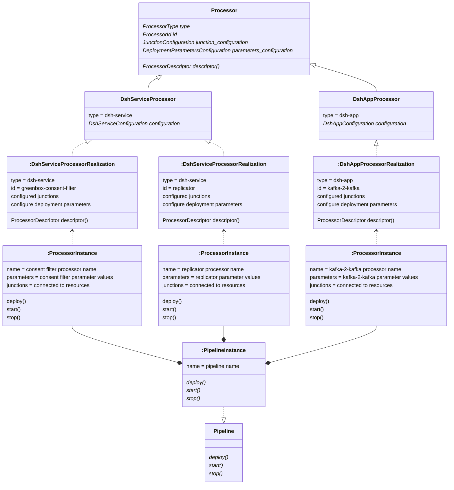

# Trifonius model

## Processors

### _Processor_

A _Processor_ is an abstraction of all data processing components under control of Trifonius.
Following this abstraction, all processors can be treated exactly the same,
e.g. all _Processors_ have `deploy()`, `start()`, `stop()` and `undeploy()` methods.
Also, all _Processors_ can describe their capabilities and required instance parameters
in the same way, and describe how they can be connected to _Resources_ or other _Processors_.

### _ProcessorTechnology_

A _ProcessorTechnology_ is a technical solution by which Trifonius can realize the data _Processor_
components. For example, the `dsh-service` processor technology supports the application
of DSH containers on a DSH platform.

### _ProcessorRealization_

A _ProcessorRealization_ defines how one specific component from a _ProcessorTechnology_
can be used by Trifonius.
Typically, this is done by composing a configuration file that further defines how a
technology component (e.g. a DSH container) can be utilized.
A _ProcessorTechnology_ together with its configuration yields a _ProcessorRealization_.
These _ProcessorRealizations_ show up in the Trifonius user interface,
where they can be selected and where all the required deployment parameters can be set.
Also, the junctions (which connect a _Processor_ to the _Resources_) need to be defined.

The configuration must specify things like

* technology, realization type, description and version for this _ProcessorRealization_,
* inbound and outbound junctions, via which a _Processor_ can consume or produce its data,
* deployment parameters, that the _Pipeline_ designer must provide when using this
  _ProcessorRealization_ in a _Pipeline_,
* metadata and links that are relevant for this _ProcessorRealization_,
* deployment _Profiles_,
* parameters that are specific for this _ProcessorRealization_.

### _ProcessorInstance_

When a _ProcessorRealization_ is used as part of a _Pipeline_,
the _Pipeline_ designer must provide values for all required deployment parameters,
connect the junctions of the _ProcessorRealization_ to compatible _ResourceInstances_
and select the _Profile_ to be used.
The _ProcessorRealization_ together with these values yields a _ProcessorInstance_.
_ProcessorInstances_ can only exist in the context of a _Pipeline_.
Operations on the _Pipeline_, like `start()` or `stop()`,
will result in operations on the _ProcessorInstances_ that constitute the _Pipeline_.

### Diagram

### Supported _Processors_

At this time the only supported type of _Processor_ is the `dsh-service`,
which enables the deployment of containers from the container registry (Harbor) to the DSH.
The _Processor_ type `dsh-app` is planned and will allow deployment of Apps
from the App Catalog. Possible new `Processor` types could for example support
the deployment of Flink jobs.

### `dsh-service`

A `dsh-service` _Processor_ enables the deployment of containers from the container registry
(Harbor) to the DSH.
The process of designing, developing and pushing the containers to the registry
is typically not part of the Trifonius workflow.
As far as Trifonius is concerned, these containers are already there,
and they are merely made available to Trifonius by composing a `dsh-service`
configuration file, which specifies how a container in the registry
can be deployed via Trifonius.
A `dsh-service` _Processor_ together with the configuration file yields a `ProcessorRealization`.
Examples of `ProcessorRealizations` are:

* `greenbox-consent-filter`
* `egex-filter`
* `replicator`

### `dsh-app` (_planned_)

A `dsh-app` _Processor_ enables the deployment of apps from the DSH App Catalog to the DSH.
The process of designing, developing and publishing the apps to the catalog
is typically not part of the Trifonius workflow.
As far as Trifonius is concerned, these apps are already there,
and they are merely made available to Trifonius by composing a `dsh-app`
configuration file, which specifies how an app in the catalog can be deployed via Trifonius.
A `dsh-app` _Processor_ together with the configuration file yields a `ProcessorRealization`.

## Resources

### _Resource_

### _ResourceTechnology_

### _ResourceRealization_

### _ResourceInstance_

## Pipelines

### _PipelineInstance_
