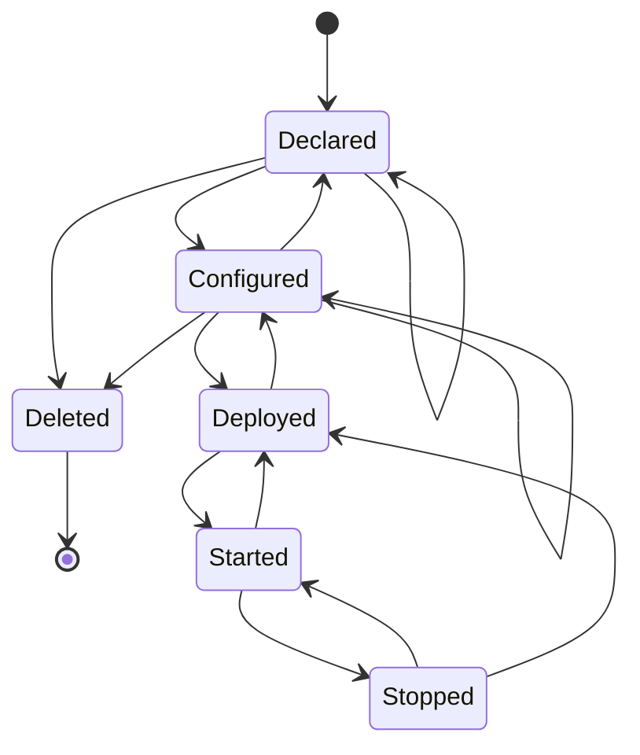

## Pipeline states

<table>
    <tr style="vertical-align: top;">
        <th>state</th>
        <th>description</th>
        <th>possible transitions</th>
    </tr>
    <tr style="vertical-align: top;">
        <td><code>Declared</code></td>
        <td>
            A <em>Pipeline</em> is <code>Declared</code> when it is known to the backend 
            <em>Pipeline</em> registry, but not yet completely and properly configured. 
            When a new <em>Pipeline</em> is saved to the backend <em>Pipeline</em> registry 
            for the first time, it is assigned a <code>PipelineName</code>, 
            which cannot be changed during the lifetime of the <em>Pipeline</em>.
        </td>
        <td>
            <code>Configured</code> 
            <code>Declared</code> 
            <code>Deleted</code>
        </td>
    </tr>
    <tr style="vertical-align: top;">
        <td><code>Configured</code></td>
        <td>
            A <em>Pipeline</em> is <code>Configured</code> when it is saved in the <em>Pipeline</em> registry 
            with a complete and correct configuration. When a <em>Pipeline</em> is <code>Configured</code>, 
            is it eligible for deployment.
        </td>
        <td>
            <code>Configured</code> 
            <code>Declared</code> 
            <code>Deleted</code> 
            <code>Deployed</code>
        </td>
    </tr>
    <tr style="vertical-align: top;">
        <td><code>Deployed</code></td>
        <td>
            A <em>Pipeline</em> is <code>Deployed</code> when it is properly deployed and configured 
            on the DSH platform, but not yet <code>Started</code>.
        </td>
        <td>
            <code>Configured</code> 
            <code>Started</code>
        </td>
    </tr>
    <tr style="vertical-align: top;">
        <td><code>Started</code></td>
        <td>
            A <em>Pipeline</em> is <code>Started</code> when it is properly deployed and configured 
            on the DSH platform, and was started successfully.
        </td>
        <td>
            <code>Deployed</code> 
            <code>Stopped</code>
        </td>
    </tr>
    <tr style="vertical-align: top;">
        <td><code>Stopped</code></td>
        <td>
            A <em>Pipeline</em> is <code>Stopped</code> when it is deployed to the DSH platform. This does not mean that it is already started.
        </td>
        <td>
            <code>Deployed</code> 
            <code>Started</code>
        </td>
    </tr>
    <tr style="vertical-align: top;">
        <td><code>Deleted</code></td>
        <td>
            A <em>Pipeline</em> is <code>Deleted</code> when it has been successfully removed from the 
            backend <em>Pipeline</em> registry. A <code>Deleted</code> <em>Pipeline</em> is no longer available
            for any action.
        </td>
        <td></td>
    </tr>
</table>
