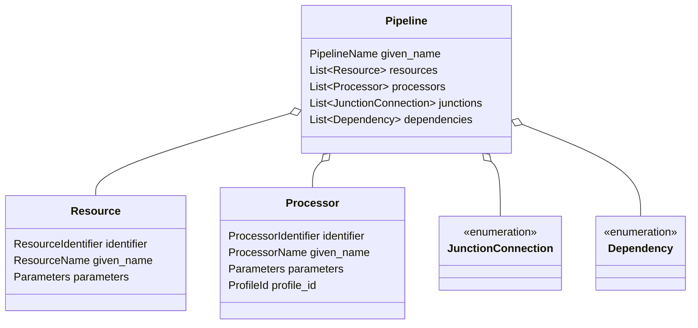
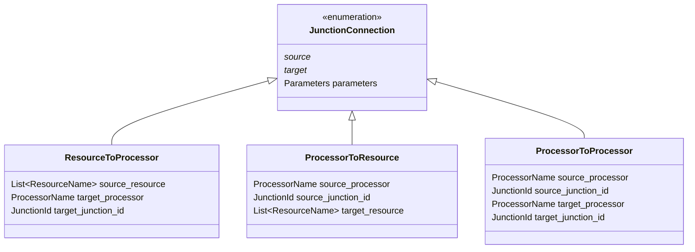
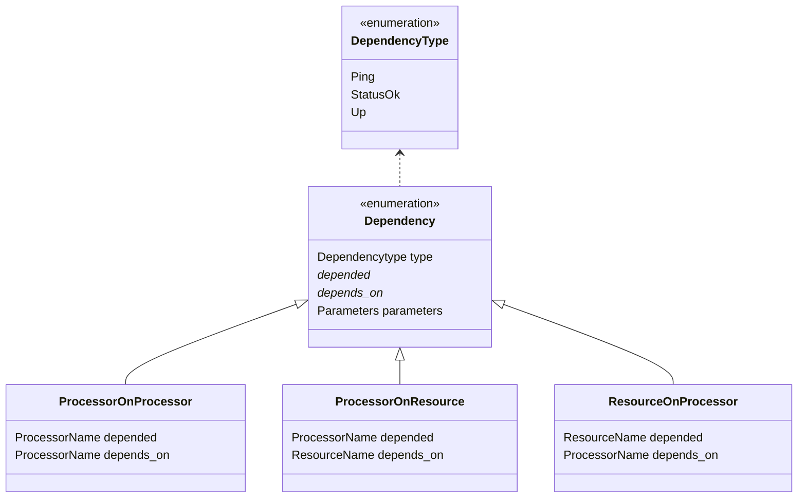

# Pipeline

```mermaid
classDiagram
    class Pipeline {
        PipelineName given_name
        List~Resource~ resources
        List~Processor~ processors
        List~JunctionConnection~ junctions
        List~Dependency~ dependencies
    }
    class Resource {
        ResourceIdentifier identifier
        ResourceName given_name
        Parameters parameters
    }
    Pipeline o-- Resource
    class Processor {
        ProcessorIdentifier identifier
        ProcessorName given_name
        Parameters parameters
        ProfileId profile_id
    }
    Pipeline o-- Processor
    class JunctionConnection {
    }
    <<enumeration>> JunctionConnection
    Pipeline o-- JunctionConnection
    class Dependency {
    }
    <<enumeration>> Dependency
    Pipeline o-- Dependency
```

```mermaid
classDiagram
    class JunctionConnection {
        source*
        target*
        Parameters parameters
    }
    <<enumeration>> JunctionConnection
    class ResourceToProcessor {
        List~ResourceName~ source_resource
        ProcessorName target_processor
        JunctionId target_junction_id
    }
    JunctionConnection <|-- ResourceToProcessor
    class ProcessorToResource {
        ProcessorName source_processor
        JunctionId source_junction_id
        List~ResourceName~ target_resource
    }
    JunctionConnection <|-- ProcessorToResource
    class ProcessorToProcessor {
        ProcessorName source_processor
        JunctionId source_junction_id
        ProcessorName target_processor
        JunctionId target_junction_id
    }
    JunctionConnection <|-- ProcessorToProcessor
```

```mermaid
classDiagram
    class DependencyType {
        Ping
        StatusOk
        Up
    }
    <<enumeration>> DependencyType
    class Dependency {
        Dependencytype type
        depended*
        depends_on*
        Parameters parameters
    }
    DependencyType <.. Dependency
    class ProcessorOnProcessor {
        ProcessorName depended
        ProcessorName depends_on
    }
    Dependency <|-- ProcessorOnProcessor
    class ProcessorOnResource {
        ProcessorName depended
        ResourceName depends_on
    }
    Dependency <|-- ProcessorOnResource
    class ResourceOnProcessor {
        ResourceName depended
        ProcessorName depends_on
    }
    Dependency <|-- ResourceOnProcessor
    <<enumeration>> Dependency
```
