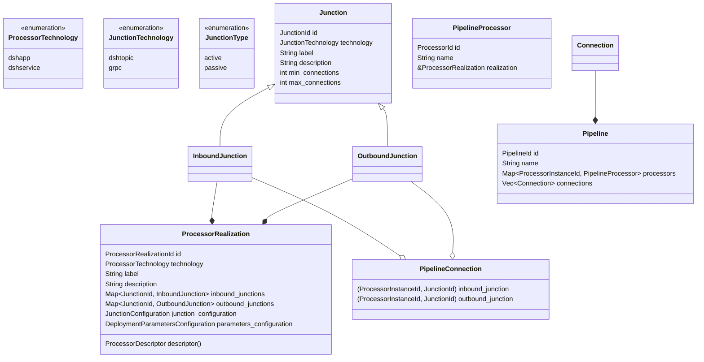

# Processor realization

pub junction_technology: JunctionTechnology,
pub label: String,
pub description: String,
pub minimum_number_of_connections: Option<u32>,
pub maximum_number_of_connections: Option<u32>,

## _Junctions_

_Junctions_ are the connection points of _Processors_,
e.g. the points where a _Processor_ can connect to
another _Processor_ or a _Resource_.

A _Junction_ always belongs to precisely one _Processor Realization_.
One _Processor Realization_ can have any number of _Inbound Junctions_ or _Outbound Junctions_.
A _Processor_ which has either _Inbound Junctions_ or _Outbound Junctions_ (not both)
can be seen as a _Resource_.

### _Junction_ characteristics

#### `JunctionId`

Each _Junction_ must have a `JunctionId` that uniquely identifies the _Junction_
in the scope of the _Processor Realization_ that the _Junction_ belongs to.
No two _Junctions_ in one _Processor Realization_ can have the same `JunctionId`,
but the same `JunctionId` can be used in two different _Processor Realizations_.

#### Name, description, metadata

Each _Junction_ must have a human-readable name and description that can be used
in the interaction with the user. Besides that, a _Junction_ can also have metadata

have a `JunctionId` that uniquely identifies the _Junction_
in the scope of the _Processor Realization_ that the _Junction_ belongs to.
No two _Junctions_ in one _Processor Realization_ can have the same `JunctionId`,
but the same `JunctionId` can be used in two different _Processor Realizations_.

#### Inbound or outbound

* When data flows in to a _Junction_, it is called an _Inbound Junction_.
* When data flows out of a _Junction_, it is called an _Outbound Junction_.
* _Inbound Junctions_ are sometimes called sink or consumer junctions.
* _Outbound Junctions_ are sometimes called source or producer junctions.

Whether a _Junction_ is an _Inbound Junction_ or an _Outbound Junction_
is solely determined by the direction of the data.
It does not depend on the used technology or whether the used data pattern is
streaming, batch, request/response et cetera.

#### Active _Junction_

A _Junction_ is called `Active` if its implementation is responsible
for setting up the technical connection between two connecting _Processors_
at deployment/startup time.
An `Active` _Junction_ needs parameters to be able to set up the connection.
These parameters can be defined in the _Processor Realization_'s configuration file.
At startup time the actual parameter values will be provided by either the DSH platform
(typically from environment variables injected by the platform)
or the Trifonius engine (which gets the parameter values from the configuration
or from passive _Junctions_ in other _Processor Realizations_ in the _Pipeline_).

Examples of `Active` _Inbound Junctions_:

* connecting to a Kafka topic as a consumer,
* connecting to any _Resource_ external to Trifonius
  (database, S3, et cetera) with read privileges,
* connecting to any passive _Outbound Junction_
  in another _Processor_ with a compatible `JunctionTechnology`,

Examples of `Active` _Outbound Junctions_:

* connecting to a Kafka topic as a producer,
* connecting to any _Resource_ external to Trifonius
  (database, S3, et cetera) with write privileges,
* connecting to any passive _Inbound Junction_
  on another _Processor_ with a compatible `JunctionTechnology`,

#### Passive _Junction_

A _Junction_ is called `Passive` if its implementation is not responsible
for setting up the technical connection between two connecting _Processors_
at deployment/startup time.
However, a passive _Junction_ does have the responsibility for providing the necessary parameters
for `Active` _Junctions_ in other _Processors_ that need to connect to the passive _Junction_.
These parameters can be defined in the _Processor Realization_'s configuration file.
At startup time the actual parameter values will be made available to the
connecting `Active` _Junctions_
via the Trifonius engine (which composes the parameter values from the configuration
in the _Processor Realizations_ and the values injected by the DSH platform at startup time.

#### `JunctionTechnology`

* Trifonius proprietary api (gRPC),
* Kafka topic,
* S3 bucket, either via the DSH platform or external,
* Database, either as-a-service on the DSH platform or external,

## _Connections_

When an _InboundJunction_ is attached to an _OutboundJunction_
this is called a _Connection_,
so a _Connection_ consists of

* one _InboundJunction_,
* one _OutboundJunction_,
* optional metadata,
* an optional operational profile.

A _Connection_ always belongs to precisely one _Pipeline_.
One _Pipeline_ can have any number of _Connections_.

#### Direction

### JunctionTechnology

A junction is a connection from

* a

Junction

