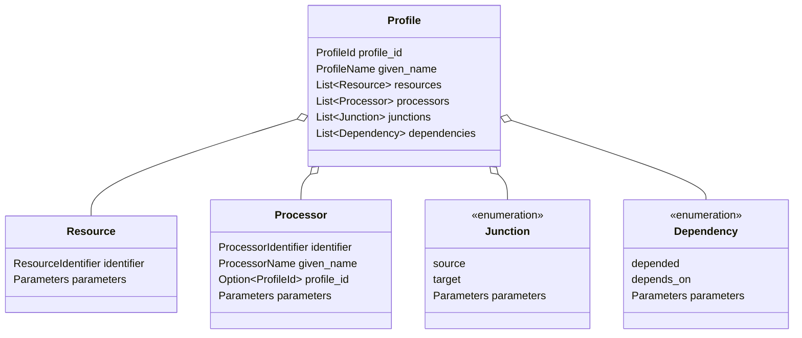
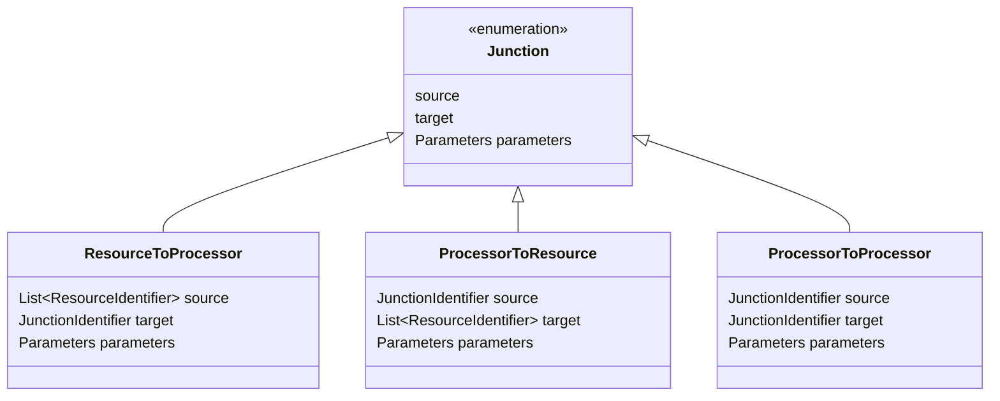
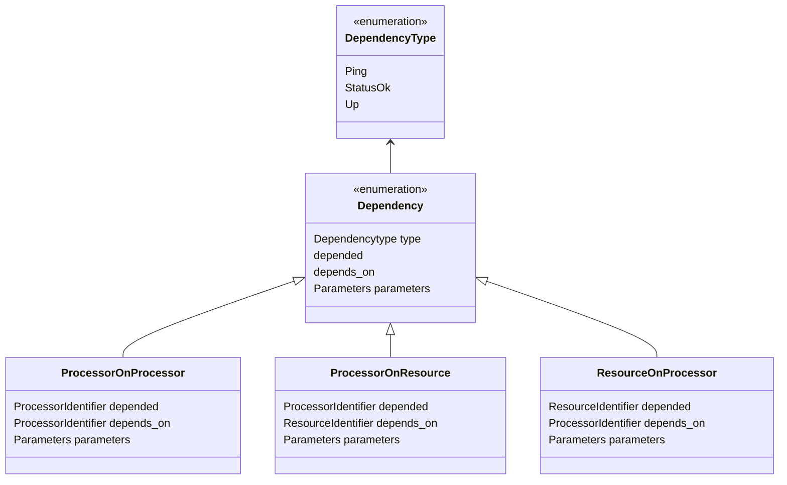

# Profile

```mermaid
classDiagram
    class Profile {
        ProfileId profile_id
        ProfileName given_name
        List~Resource~ resources
        List~Processor~ processors
        List~Junction~ junctions
        List~Dependency~ dependencies
    }
    class Resource {
        ResourceIdentifier identifier
        Parameters parameters
    }
    Profile o-- Resource
    class Processor {
        ProcessorIdentifier identifier
        ProcessorName given_name
        Option~ProfileId~ profile_id
        Parameters parameters
    }
    Profile o-- Processor
    class Junction {
        source
        target
        Parameters parameters
    }
    <<enumeration>> Junction
    Profile o-- Junction
    class Dependency {
        depended
        depends_on
        Parameters parameters
    }
    <<enumeration>> Dependency
    Profile o-- Dependency
```

```mermaid
classDiagram
    class Junction {
        source
        target
        Parameters parameters
    }
    class ResourceToProcessor {
        List~ResourceIdentifier~ source
        JunctionIdentifier target
        Parameters parameters
    }
    Junction <|-- ResourceToProcessor
    class ProcessorToResource {
        JunctionIdentifier source
        List~ResourceIdentifier~ target
        Parameters parameters
    }
    Junction <|-- ProcessorToResource
    class ProcessorToProcessor {
        JunctionIdentifier source
        JunctionIdentifier target
        Parameters parameters
    }
    Junction <|-- ProcessorToProcessor
    <<enumeration>> Junction
```

```mermaid
classDiagram
    class DependencyType {
        Ping
        StatusOk
        Up
    }
    <<enumeration>> DependencyType
    class Dependency {
        Dependencytype type
        depended
        depends_on
        Parameters parameters
    }
    DependencyType <-- Dependency
    class ProcessorOnProcessor {
        ProcessorIdentifier depended
        ProcessorIdentifier depends_on
        Parameters parameters
    }
    Dependency <|-- ProcessorOnProcessor
    class ProcessorOnResource {
        ProcessorIdentifier depended
        ResourceIdentifier depends_on
        Parameters parameters
    }
    Dependency <|-- ProcessorOnResource
    class ResourceOnProcessor {
        ResourceIdentifier depended
        ProcessorIdentifier depends_on
        Parameters parameters
    }
    Dependency <|-- ResourceOnProcessor
    <<enumeration>> Dependency
```
