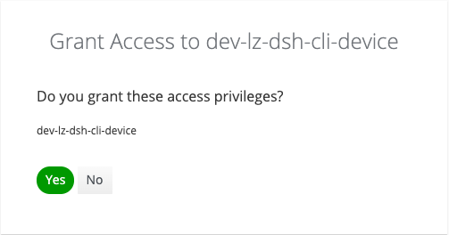

# Quick start

[&#x2190; README](../README.md)

When the `dsh` tool is installed properly, you can run it by simply typing a command in your
favorite shell. When a command requires you to be logged in, the tool will tell you, and when a
command requires parameters you will be prompted for them. However, there are
also commands that do not require being logged in or any parameters. For example, to see a
list of the available platforms, type:

```shell
> dsh platforms
┌────────────────────┬────────┬────────────────────┬────────────┬──────────────────────────────────────────────┬───────────────────────────────────────────────┐
│ platform id        │ alias  │ realm              │ production │ description                                  │ console url                                   │
├────────────────────┼────────┼────────────────────┼────────────┼──────────────────────────────────────────────┼───────────────────────────────────────────────┤
│ k8s-dev-aws-lz-dsh │ devlz  │ k8s-dev-aws-lz-dsh │ false      │ Development platform for Klarrio             │ https://console.dev.dsh-k8s.np.aws.kpn.com    │
│ np-aws-lz-dsh      │ nplz   │ dev-lz-dsh         │ false      │ Staging platform for KPN internal tenants    │ https://console.dsh-dev.dsh.np.aws.kpn.com    │
│ poc-aws-dsh        │ poc    │ poc-dsh            │ true       │ Staging platform for non KPN tenants         │ https://console.poc.kpn-dsh.com               │
│ prod-aws-dsh       │ prod   │ prod-dsh           │ true       │ Production platform for non KPN tenants      │ https://console.kpn-dsh.com                   │
│ prod-aws-lz-dsh    │ prodlz │ prod-lz-dsh        │ true       │ Production platform for KPN internal tenants │ https://console.dsh-prod.dsh.prod.aws.kpn.com │
│ prod-azure-dsh     │ prodaz │ prod-azure-dsh     │ true       │ Production platform for non KPN tenants      │ https://console.az.kpn-dsh.com                │
└────────────────────┴────────┴────────────────────┴────────────┴──────────────────────────────────────────────┴───────────────────────────────────────────────┘
```

Most commands however do require you to be logged in, and do require parameters. For example,
to get a list of the configured secrets for `my-tenant` on platform `np-aws-lz-dsh`, just type:

```shell
> dsh secret list
target platform: np-aws-lz-dsh
target tenant: my-tenant
please log in to platform `np-aws-lz-dsh` using the 'dsh login np-aws-lz-dsh' command
user is not authenticated
```

Since you did not provide the name of the platform and the tenant and this command requires them,
you were prompted for these values. But you also need to be logged in for this command,
so that will be the next step.

Assuming that you are member of the tenant `my-tenant` on the platform `np-aws-lz-dsh`, you can
log in by typing the following command in your shell:

```shell
> dsh login np-aws-lz-dsh
opening login page for platform 'np-aws-lz-dsh'
```

This will direct you to a web page where you can authenticate with your username/password or any
other means that is available. Most likely a two-factor log in process is required.
When logging in was successful you will see the following page where you have to grant the
`dsh` tool the required privilege.



After confirmation by clicking the `Yes` button, move back to your shell where you will see the
tenants that you are authorized for.

```shell
you are logged in
authorized tenants: my-tenant, my-tenant1, my-tenant2, my-tenant3, my-tenant4
```

Now we can try again:

```shell
> dsh secrets --platform nplz --tenant my-tenant
┌─────────────┬────────┬─────────┬────────┬──────────┬─────────────┬─────────┬────────┬───────────────┐
│ secret name │ system │ kind    │ format │ size     │ description │ expires │ status │ notifications │
├─────────────┼────────┼─────────┼────────┼──────────┼─────────────┼─────────┼────────┼───────────────┤
│ ...         │        │         │        │          │             │         │        │               │
│ my-secret   │        │ regular │ string │ 16 chars │             │         │        │               │
└─────────────┴────────┴─────────┴────────┴──────────┴─────────────┴─────────┴────────┴───────────────┘
```

Note that this time we provided the platform name and the tenant name directly on the command line,
so we were not prompted for them. Also, we used the alias `nplz` for the platform name instead
of the full name `np-aws-lz-dsh`. Finally, we used the command `secrets`, which is a shortcut for
the `secret list` command. This postfix `s` is available for all commands that have a `list`
subcommand.

Typically, you will be submitting commands for the same platform and tenant quit often.
In this case you can set the default platform and default tenant via a command:

```shell
> dsh setting set default-platform np-aws-lz-dsh
default platform set to np-aws-lz-dsh
> dsh setting set default-tenant my-tenant
default tenant set to my-tenant
```

Now you can get the same list of secrets by just typing:

```shell
> dsh secrets
...
```

Alternatively you can also provide the default parameters via environment variables:

```shell
> export DSH_CLI_PLATFORM=np-aws-lz-dsh
> export DSH_CLI_TENANT=my-tenant
```

Note that the environment variables take precedence over the default settings while the
command line options take precedence over the environment variables. See the
next page for an overview of all ways to define the platform and tenant names.

[User guide &#x2192;](user_guide.md)
